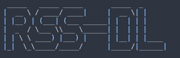

# RSS-dl


rss-dl is a simple docker based rss downloader


https://git.bossman7309.net/

^may be behind

creator:

https://github.com/bossman7309
https://bossman7309.net/

pi-hosted:

https://github.com/novaspirit/pi-hosted

docker pull bossman7309/rss-dl

docker compose:
```
version: '3.8'

services:
  youtube-downloader:
    image: rss-dlv1:latest
    environment: 
      - CHANNEL_URL=https://www.youtube.com/example/videos
      - DOWNLOAD_PATH=/portainer/Files/AppData/Config/rss-dl
    volumes:
      - /portainer/Files/AppData/Config:/downloads
    restart: unless-stopped

```


